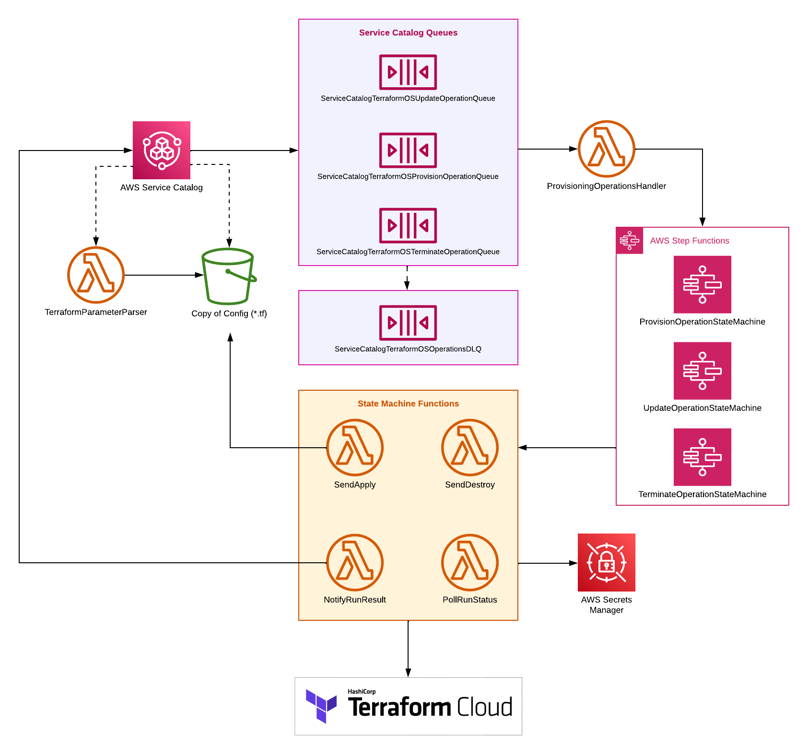

# AWS Service Catalog Engine for Terraform Cloud
The AWS Service Catalog Engine for Terraform Cloud (TFC-RE) is an integration between AWS Service Catalog and Terraform Cloud that allows users to provision Service Catalog products using TFC. This integration gives administrators governance and visibility into their Terraform workloads, and allows Service Catalog administrators to delegate cloud resource provisioning responsibilities to users within their organizations.

# Prerequisites
1. A Terraform Cloud organization that supports [Team Management](https://www.hashicorp.com/products/terraform/pricing).
2. A way to authenticate the AWS provider (see documentation [here](https://registry.terraform.io/providers/hashicorp/aws/latest/docs#authentication-and-configuration) for list of options).
3. An [API Token](https://developer.hashicorp.com/terraform/cloud-docs/users-teams-organizations/api-tokens) to use to authenticate the TFE Terraform Provider.
4. The [Terraform CLI](https://developer.hashicorp.com/terraform/tutorials/aws-get-started/install-cli) tools.

# Install the Terraform Cloud Reference Engine

## Getting Started

### Set Up Your Environment
1. `git clone` the project.
2. Export the following environment variables:
   `AWS_ACCOUNT_ID=<YOUR AWS ACCOUNT ID>
   AWS_REGION=<YOUR REGION OF CHOICE>`

For further information regarding credentials, please follow the steps outlined in their AWS [developer guide](https://docs.aws.amazon.com/sdk-for-java/v1/developer-guide/setup-credentials.html).

### Launch the Engine
To launch the engine, you'll need to set the `TFE_TOKEN` environment variable to a Terraform Cloud user token. It is important to note that this user will need permissions to create Teams and other authentication tokens.
For more information on TFC permissions, please refer to this [documentation](https://developer.hashicorp.com/terraform/cloud-docs/users-teams-organizations/permissions).

You'll also need to authenticate the AWS provider as you would normally, using one of the methods mentioned in the AWS provider documentation [here](https://registry.terraform.io/providers/hashicorp/aws/latest/docs#authentication-and-configuration).

After authenticating with both AWS and Terraform Cloud, do the following:
1. Copy `terraform.tfvars.example` to `terraform.tfvars` and set the organization name to your Terraform Cloud organization name.
2. Run `terraform plan` to verify your setup, and then run `terraform apply` to apply your changes.

### Test the Engine
Once you've applied the configuration, you should see a newly created AWS Service Catalog portfolio in [your AWS Service Catalog dashboard](https://console.aws.amazon.com/servicecatalog/home).

To test your newly provisioned Service Catalog Engine for Terraform Cloud, follow [the guide to granting access to portfolios](https://docs.aws.amazon.com/servicecatalog/latest/adminguide/catalogs_portfolios_users.html). Navigate to the newly provisioned `"TFC Example Portfolio"` and grant access to a user of your choosing. Instruct the newly assigned "test user" to attempt to provision the included example product that this engine creates (it is already assigned to the `"TFC Example Portfolio"`).

The example product mentioned above can be found [here](https://github.com/hashicorp/aws-service-catalog-engine-for-tfc/tree/main/example-product).

## Troubleshooting Terraform Authentication
If you run into TFC workspace issues, such as issues when creating TFC workspaces, it may mean that the [Team](https://developer.hashicorp.com/terraform/cloud-docs/users-teams-organizations/teams) that has been created to launch products for your AWS Service Catalog account may not have the correct set of permissions on Terraform Cloud.

**Solution:** Re-apply the engine's Terraform to reset the Team's permissions (thus re-granting it permissions to create and manage workspaces within your organization).

# Architecture
To better understand the TFC-RE architecture, please refer to the following diagram:

# Creating and Provisioning a Product in Service Catalog
The TFC-RE creates an example product upon launch, however, if you’d prefer to create a new product using the Service Catalog UI, please refer to AWS' documentation.

# Token Rotation

## Updating Token Rotation Frequency
To enhance security, the Terraform Cloud team token associated with your account is automatically rotated every 30 days. However, the frequency in which the token rotation occurs is customizable. The following can be done to update the rotation frequency:
1. Update the token rotation frequency within the Terraform configuration itself. This can be done by updating the [`aws_cloudwatch_event_rule` resource](https://github.com/hashicorp/aws-service-catalog-engine-for-tfc/blob/main/token_rotation.tf#L198) within the TFC-RE and running `terraform apply` to apply these changes.

# Troubleshooting

### Exceptions
The TFC-RE can throw exceptions. An exception that can be expected is:
1. `NoFilesToParseExceptionMessage`: This exception is thrown when the parser is unable to find a `.tf` file to parse, or when the Terraform configuration does not contain a `.tf` file for the `root` module. To ensure that your file contains `.tf` files at the root level, try recreating the file using the commands in the Terraform Cloud API-driven workflow guide [here](https://developer.hashicorp.com/terraform/cloud-docs/run/api#2-create-the-file-for-upload).

# Monitoring

## Monitoring with AWS

### AWS CloudWatch
For more insight on provisioned products and general Service Catalog metrics, CloudWatch can provide further insights through the use of dashboards and monitors. For more information on CloudWatch, please refer to this AWS developer [documentation](https://docs.aws.amazon.com/AmazonCloudWatch/latest/monitoring/WhatIsCloudWatch.html).

### AWS X-Ray
AWS X-Ray provides insight and traces that can help identify and debug issues. For more insight on things like Lambda Functions and any alerts associated with them, X-Ray can be a helpful resource. For more information on X-Ray, please refer to this AWS developer [documentation](https://docs.aws.amazon.com/xray/latest/devguide/aws-xray.html).

### AWS Step Functions
The AWS Step Functions service provides further insight into each of the four Step Functions that the TFC-RE uses:`ServiceCatalogTFCTokenRotationStateMachine`, `ServiceCatalogTFCProvisionOperationStateMachine`, `ServiceCatalogTFCUpdateOperationStateMachine`, and `ServiceCatalogTFCTerminateOperationStateMachine`. Clicking into a particular Step Function can provide insight into all State Machine executions and allows you to click into particular executions for more insight into the State Machine’s polling mechanisms. The polling view can also provide more informative errors and has a direct link to the CloudWatch logs associated with the execution. For more information on AWS Step Functions, please refer to this AWS developer [documentation](https://docs.aws.amazon.com/step-functions/latest/dg/welcome.html).

### AWS Lambda
For more insight into a particular Lambda function, leveraging the AWS Lambda service can be helpful. This service can provide information regarding the Lambda’s code source, code properties, and runtime settings, for example. For more information on AWS Lambda Functions, please refer to this AWS developer [documentation](https://docs.aws.amazon.com/lambda/latest/dg/welcome.html).

### Amazon SQS
The Amazon SQS contains information regarding Service Catalog workloads. The Amazon SQS service can provide information regarding Lambda triggers, tagging, access policies, and more for a given queue. It also contains the dead-letter queue. Each queue has its own “message retention period,” which is the duration that the messages will be kept. The message retention period is configurable, and is set to 4 days by default for the TFC-RE. For more information on Amazon SQS, please refer to this AWS developer [documentation](https://docs.aws.amazon.com/AWSSimpleQueueService/latest/SQSDeveloperGuide/welcome.html), and for more information on setting queue attributes, please refer to this AWS developer [documentation](https://docs.aws.amazon.com/AWSSimpleQueueService/latest/APIReference/API_SetQueueAttributes.html).

# TFE Token Rotation
To monitor token rotation, an AWS Admin can search for metrics related to the `TerraformEngineRotateToken` event rule in AWS CloudWatch.

## Monitoring with TFC

### Run Outputs
There are a few places where you can monitor your organization’s TFC runs and workspaces, but one of the easiest places to monitor them is under the “Runs” tab for a particular workspace. The “Runs” tab will contain each run for a particular workspace. Additionally, you can click into a workspace run from this view, allowing you to gain further insight into the state of the run and where and why it errored. This view also contains the raw log for a given run and its sentinel mocks. For more information on TFC runs, please refer to this [documentation](https://developer.hashicorp.com/terraform/cloud-docs/api-docs/run).

# Uninstalling the Integration
To uninstall the integration, you should first destroy any necessary information in AWS. Next, run the `terraform destroy` command. This will remove the integration.

# Limitations

## Artifact File Types
Provisioning artifacts must be a tar file, in the `.tar.gz` format, with a filename extension of `.tar.gz`. Additionally, all Terraform configuration files must be a Terraform file, in the `.tf` format, with a filename extension of `.tf`. Currently, these two file types are the only ones excepted, and providing anything different as a provisioning artifact can result in failures to complete the provisioning process.

### Troubleshooting Artifact Files
If you run into issues with the artifact files, ensure that the filename extensions are correct—tar files must be in the `.tar.gz` format and Terraform files must be in the `.tf` format. If the filename extensions are not the root cause, next ensure that the `.tar.gz` file is located in the `root` directory.

# Maximum Configuration Version Size
The maximum configuration version size supports files up to 950KB. Files larger than 950KB will result in a failure within AWS Service Catalog.

## Parameter Parser

### Parsing Large Artifacts
AWS Lambdas have a memory size constraint. This limitation can lead to issues when attempting to parse large provisioning artifacts, namely artifacts that are over 500 KB.

## Resource Timeouts
If the provisioning step takes too long, the AWS Service Catalog will timeout. This can also cause the Terraform to timeout, as it has a 30-minute timeout limit. To resolve this timeout issue, try to rerun the provisioning step, or try re-`apply`ing the Terraform.

# Common Error States and How to Resolve Them

## State Machine Timeout
**Error:** `A lambda function invoked by the state machine has timed out`

**Cause:** This error occurs when a Lambda function times out.

**Solution:** To resolve this error, try rerunning the operation. Additionally, please file an issue in the [repository](https://github.com/hashicorp/aws-service-catalog-engine-for-tfc/issues), or contact HashiCorp support.

## Issues with the Service Catalog Product Version
It is important to create a new product version anytime the configuration has been modified. In doing this, you should be able to avoid issues associated with Service Catalog Product Versions.

## Error Creating Team
**Error:** `Error: Error creating team aws-service-catalog for organization <org-name>: resource not found`

**Cause:** This error occurs when a `TFE_TOKEN` has not been set, or the `tfc_organization` variable wasn't provided correctly.

**Solution:** Check that the `tfc_organization` value you provided exactly matches the name of your TFC organization. Also make sure you have set the `TFE_TOKEN` environment variable to a valid [API Token](https://developer.hashicorp.com/terraform/cloud-docs/users-teams-organizations/api-tokens).

For more information on authentication tokens, please refer to this [documentation](https://developer.hashicorp.com/terraform/cloud-docs/users-teams-organizations/api-tokens).

# Contributing
For more information on how to contribute, please refer to the [Contributing Guide](https://github.com/hashicorp/aws-service-catalog-engine-for-tfc/blob/main/CONTRIBUTING.md).

# Attributions
1. [Terraform](https://github.com/hashicorp/terraform)
2. [AWS Service Catalog Engine for Terraform Open Source](https://github.com/aws-samples/service-catalog-engine-for-terraform-os)
3. [AWS Service Catalog Documentation](https://docs.aws.amazon.com/servicecatalog/index.html)
